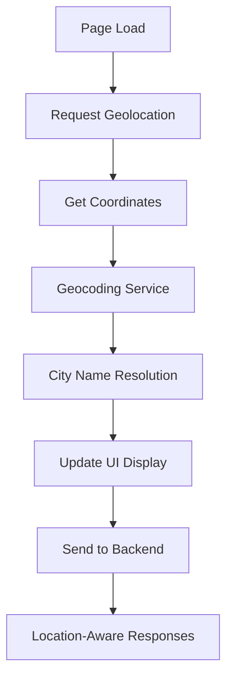

# Apollo Tyres AI Chatbot

A comprehensive AI-powered chatbot system for Apollo Tyres that provides location-based recommendations, product information, and customer support with advanced analytics.

## 🚀 Features

### Core Functionality
- **AI-Powered Responses**: Uses Google Gemini 2.0 Flash for intelligent tyre recommendations
- **Location-Based Services**: Automatic city detection and location-specific recommendations
- **Real-time Chat**: WebSocket-based real-time communication
- **Dynamic Suggestions**: Context-aware question suggestions based on conversation history
- **Feedback System**: User feedback collection with detailed analytics
- **Lead Capture**: Automated callback request handling
- **Comprehensive Analytics**: Detailed user behavior tracking and session analytics

### Location Features
- **Automatic Location Detection**: Uses browser geolocation API
- **City Name Resolution**: Converts coordinates to readable city names via geocoding
- **Regional Context**: Provides region-specific recommendations (Northern, Southern, Central, Eastern, Western India)
- **Location-Based Session IDs**: Tracks users by geographic location
- **Dealer Recommendations**: Suggests nearby Apollo Tyres dealers and service centers

### Security & Performance
- **HTTPS Support**: Full SSL/TLS encryption for secure communication
- **WebSocket Security**: Secure real-time communication
- **Response Caching**: Geocoding results cached for performance
- **Error Handling**: Comprehensive error handling and fallback mechanisms

## 🏗️ Architecture

### Backend (FastAPI)
```
app/
├── __init__.py
├── main.py                 # FastAPI application entry point
├── config.py              # Configuration management
├── database.py            # Database operations and schema
├── analytics.py           # Analytics and user tracking
├── geocoding.py           # Location services and city detection
├── llm_setup.py           # LLM configuration and prompts
├── vector_store.py        # ChromaDB vector store management
├── schemas.py             # Pydantic models
└── routers/
    └── chat.py            # Chat endpoints and WebSocket handlers
```

### Frontend (React)
```
frontend/
├── public/
│   └── index.html         # Main HTML with location initialization
├── src/
│   ├── components/
│   │   └── ChatWidget.jsx # Main chat interface component
│   ├── hooks/
│   │   └── useChatSocket.js # WebSocket management hook
│   ├── utils/
│   │   └── dynamicQuestions.js # Dynamic question generation
│   └── config/
       └── index.js        # Frontend configuration
```

## 🔧 Technology Stack

### Backend
- **Framework**: FastAPI (Python)
- **AI/ML**: Google Gemini 2.0 Flash, LangChain
- **Vector Database**: ChromaDB
- **Database**: MySQL 8.0
- **Location Services**: OpenStreetMap Nominatim API
- **WebSocket**: FastAPI WebSocket support

### Frontend
- **Framework**: React 18
- **State Management**: React Hooks
- **Styling**: CSS Modules
- **Real-time Communication**: WebSocket API
- **Location API**: Browser Geolocation API
- **Markdown Rendering**: ReactMarkdown with GitHub Flavored Markdown

### Infrastructure
- **Web Server**: Uvicorn with SSL support
- **SSL/TLS**: Self-signed certificates for development
- **Reverse Proxy**: Configured for production deployment
- **Caching**: File-based geocoding cache

## 🌍 Location Detection Implementation

### How It Works

1. **Browser Detection**: When the page loads, the system automatically requests user location
2. **Coordinate Capture**: Latitude and longitude are captured via browser geolocation API
3. **City Resolution**: Coordinates are sent to geocoding service to get city name
4. **Session Tracking**: Location-based session IDs are generated for analytics
5. **Context Enhancement**: Location information enhances AI responses

### Location Flow


### Geocoding Service Features
```python
# City detection from coordinates
city_name = geocoding_service.get_city_from_coordinates(lat, lng)

# Full location context
location_info = geocoding_service.get_location_info(lat, lng)
# Returns: {
#   "city": "Mumbai",
#   "region": "Western India", 
#   "latitude": 19.0760,
#   "longitude": 72.8777,
#   "coordinates": "19.0760, 72.8777"
# }
```

### Location Display
- **Header Display**: Shows city name instead of coordinates (e.g., "📍 Mumbai" instead of "📍 19.0760, 72.8777")
- **Fallback**: If city detection fails, falls back to coordinates
- **Regional Context**: Provides broader regional context for recommendations

## 🔒 HTTPS Configuration

### SSL Setup Process

1. **Certificate Generation**: Created self-signed SSL certificates for development
```bash
# Generate private key
openssl genrsa -out ssl/key.pem 2048

# Generate certificate signing request
openssl req -new -key ssl/key.pem -out ssl/cert.csr

# Generate self-signed certificate
openssl x509 -req -days 365 -in ssl/cert.csr -signkey ssl/key.pem -out ssl/cert.pem
```

2. **FastAPI SSL Configuration**:
```python
if __name__ == "__main__":
    import uvicorn
    uvicorn.run(
        app, 
        host="0.0.0.0", 
        port=9006,
        ssl_keyfile="./ssl/key.pem",
        ssl_certfile="./ssl/cert.pem"
    )
```

3. **Frontend HTTPS URLs**: Updated all API endpoints to use HTTPS
4. **WebSocket Security**: Secure WebSocket connections (WSS)

### CORS Configuration
```python
app.add_middleware(
    CORSMiddleware,
    allow_origins=[
        "http://localhost:3006",
        "https://localhost:3006", 
        "http://150.241.244.252:3006",
        "https://150.241.244.252:3006",
        "*"  # Allow all origins for development
    ],
    allow_credentials=True,
    allow_methods=["GET", "POST", "PUT", "DELETE", "OPTIONS"],
    allow_headers=["*"],
)
```

## 📊 Analytics System

### Tracked Events
- **Session Management**: Start, end, duration tracking
- **User Interactions**: Questions asked, responses received
- **Location Data**: Geographic tracking and regional analytics
- **Feedback Collection**: User satisfaction and improvement suggestions
- **Lead Capture**: Callback requests and conversion tracking
- **Error Monitoring**: System errors and failure points

### Database Schema
```sql
-- Core tables
users (user_id, first_seen_at, last_active_at, total_sessions, total_messages)
sessions (session_id, user_id, start_time, end_time, duration, location_data)
conversations (conversation_id, session_id, user_id, start_time, status)
messages (message_id, conversation_id, user_id, message_type, content)

-- Analytics tables
lead_analytics (lead_id, lead_type, name, created_at)
human_handover (handover_id, user_id, session_id, issues, support_option)
chatbot_close_events (user_id, session_id, closed_at, time_spent_seconds)
```

## 🚀 Deployment

### Prerequisites
- Python 3.8+
- Node.js 16+
- MySQL 8.0
- SSL certificates

### Backend Setup
```bash
# Clone repository
git clone <repository-url>
cd apoloTyreSample

# Install Python dependencies
pip install -r requirements.txt

# Set environment variables
export GEMINI_API_KEY="your-gemini-api-key"
export DB_HOST="localhost"
export DB_USER="your-db-user"
export DB_PASSWORD="your-db-password"

# Run backend
python -m app.main
```

### Frontend Setup
```bash
# Navigate to frontend
cd frontend

# Install dependencies
npm install

# Start development server
npm start
```

### Database Setup
```sql
-- Create database
CREATE DATABASE chatbot_analytics;

-- Run migration scripts to create tables
-- (Tables are auto-created by the analytics module)
```

## 🔧 Configuration

### Backend Configuration (`app/config.py`)
```python
class Settings:
    CSV_PATH = "data/apolloTyres_combined_cleaned.csv"
    EMBED_MODEL = "models/embedding-001"
    PERSIST_DIRECTORY = "chroma_db"
    LLM_MODEL = "gemini-2.0-flash"
    GEMINI_API_KEY = os.getenv("GEMINI_API_KEY")
    DB_HOST = os.getenv("DB_HOST", "localhost")
    DB_USER = os.getenv("DB_USER", "nirbhay")
    DB_PASSWORD = os.getenv("DB_PASSWORD", "Nirbhay@123")
    DB_NAME = os.getenv("DB_NAME", "chatbot_analytics")
```

### Frontend Configuration (`frontend/src/config/index.js`)
```javascript
const defaultConfig = {
  companyName: "Apollo Tyres",
  companyLogo: "/apollo-logo.png",
  primaryColor: "#FF6B35",
  chatUrl: "wss://150.241.244.252:9006/chat/ws",
  introductionText: "Hello! I'm Apollo Tyres AI Assistant...",
  inputPlaceholder: "Ask me about Apollo Tyres...",
  showNumberOfQuestions: 5,
  initialSuggestedQuestions: [...]
};
```

## 📱 Usage Examples

### Location-Based Recommendations
```javascript
// User in Mumbai gets:
"Based on your location in Mumbai, Western India, I recommend Apollo Alnac 4G tyres which perform excellently in coastal conditions..."

// User in Delhi gets:
"For your location in Delhi, Northern India, Apollo Aspire 4G tyres are ideal for the extreme weather conditions..."
```

### Dynamic Question Generation
```javascript
// After asking about SUV tyres:
[
  "What is the price range for Apollo SUV tyres?",
  "Which Apollo SUV tyre is best for highway driving?",
  "What's the fuel efficiency impact of Apollo SUV tyres?",
  "How long do Apollo SUV tyres typically last?",
  "Are there any special offers on Apollo SUV tyres?"
]
```

## 🔍 Monitoring & Analytics

### Real-time Analytics Dashboard
Access comprehensive analytics at: `https://your-domain:9006/analytics/`

### Key Metrics
- Total users and sessions
- Geographic distribution of users
- Popular questions and topics
- Response times and system performance
- Lead conversion rates
- User satisfaction scores

## 🛠️ Development

### Adding New Features
1. **Backend**: Add new endpoints in `app/routers/`
2. **Frontend**: Create new components in `src/components/`
3. **Analytics**: Extend tracking in `app/analytics.py`
4. **Location**: Enhance geocoding in `app/geocoding.py`

### Testing
```bash
# Test geocoding service
python test_geocoding.py

# Test location detection
python test-location-chat.py
```

## 🚨 Troubleshooting

### Common Issues

1. **Location Detection Fails**
   - Check HTTPS is enabled (required for geolocation)
   - Verify user granted location permissions
   - Check geocoding service response

2. **WebSocket Connection Issues**
   - Verify SSL certificates are valid
   - Check CORS configuration
   - Ensure port 9006 is accessible

3. **Database Connection Errors**
   - Verify MySQL service is running
   - Check database credentials
   - Ensure database exists

### Debug Mode
Enable debug logging by setting environment variable:
```bash
export DEBUG=true
```

## 📄 API Documentation

### WebSocket Endpoints
- `wss://domain:9006/chat/ws` - Main chat WebSocket
- Message format:
```json
{
  "user_input": "string",
  "user_id": "string",
  "session_id": "string",
  "user_location": {
    "latitude": "number",
    "longitude": "number",
    "city": "string"
  }
}
```

### REST Endpoints
- `POST /chat/query` - Direct query endpoint
- `GET /analytics/` - Analytics dashboard
- `POST /analytics/leads` - Lead capture
- `POST /chat/generate-questions` - Dynamic question generation

## 🤝 Contributing

1. Fork the repository
2. Create feature branch (`git checkout -b feature/amazing-feature`)
3. Commit changes (`git commit -m 'Add amazing feature'`)
4. Push to branch (`git push origin feature/amazing-feature`)
5. Open Pull Request

## 📝 License

This project is proprietary software developed for Apollo Tyres.

## 📞 Support

For technical support or questions:
- Email: tech-support@apollotyres.com
- Documentation: See inline code comments
- Analytics Dashboard: Monitor system health in real-time

---

**Built with ❤️ for Apollo Tyres customers worldwide** 